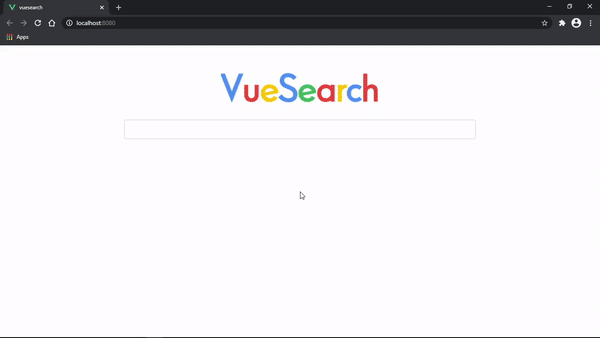

# searchengine
Search engine using Scrapy Framework to get web data, Elasticsearch to store it, Flask as backend and Vuejs Framework to visualizate it.

<p align="center">
  
</p>

## Windows 10 Dev Setup

### Python environment
```
py -3 -m venv virtualenv
```
```
.\virtualenv\Scripts\Activate.ps1
```
```
pip install -r requirements.txt
```

### Run Scrapy
See [how to install Scrapy](https://docs.scrapy.org/en/latest/intro/install.html). After installed, with Anaconda/Miniconda opened go to project root and run:
```
cd crawler\wikipedia
```
```
scrapy crawl wikipedia -O data\wikipedia.json
```

### Elasticsearch
[Install elasticsearch 7.10.1](https://www.elastic.co/guide/en/elasticsearch/reference/7.10/install-elasticsearch.html) and in another terminal run it from `.bat` file. For example:
```
C:\elasticsearch-7.10.1\bin\elasticsearch.bat
```

### Run index_data.py
Be careful to not run it twice.
```
cd backend
```
```
py index_data.py
```

### Run Flask
```
$env:FLASK_APP="server.py"
```
```
$env:FLASK_ENV="development"
```
```
flask run --host=0.0.0.0 --port=8088
```

### Vuejs environment
With [Node.js](https://nodejs.org/) installed, in another terminal, run: 
```
cd vuesearch
```
```
npm install
```
```
npm run serve
```


